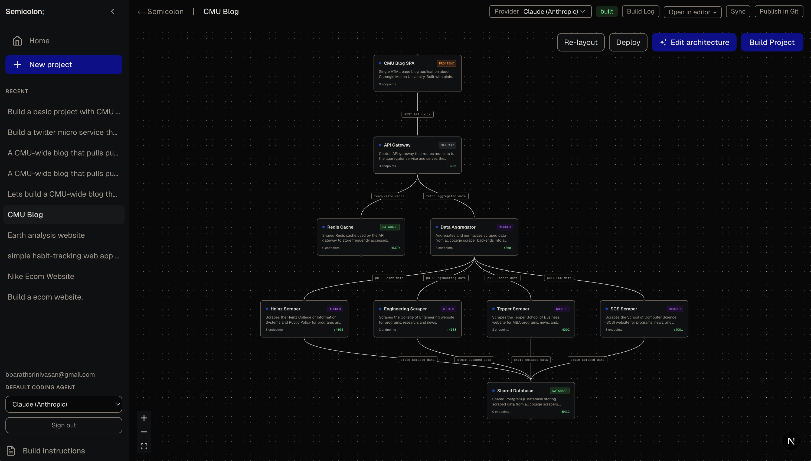
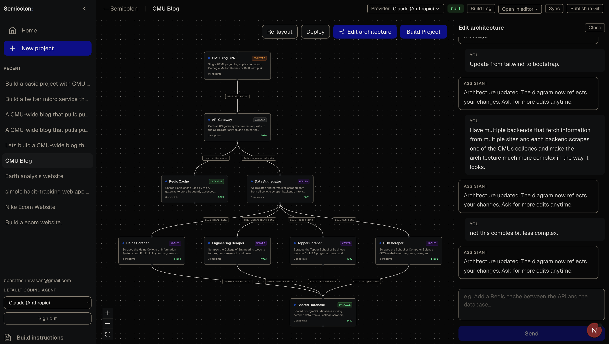
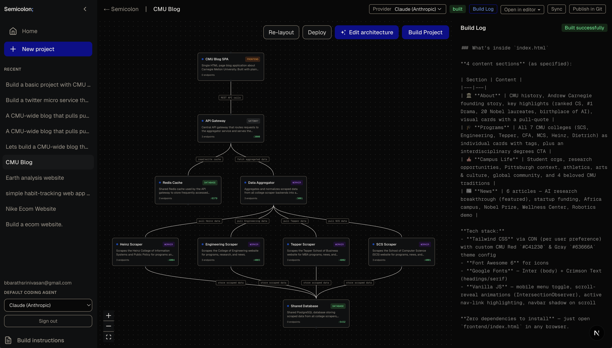
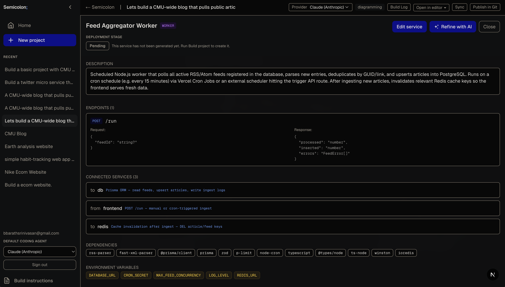
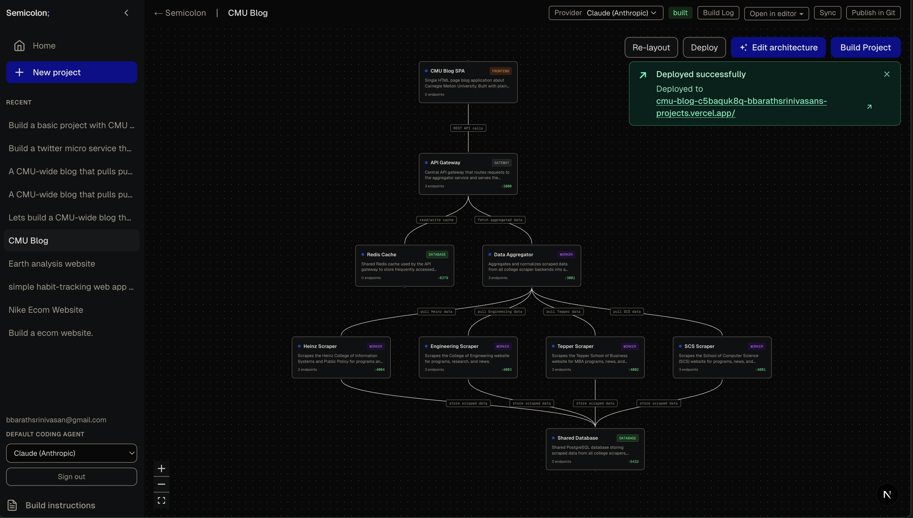

<div align="center">


**Most AI tools help you generate files. Semicolon keeps your system model and code in sync.**

<p>
  <kbd>📝 Describe once</kbd>
  <strong> → </strong>
  <kbd>🗺️ Visualize architecture</kbd>
  <strong> → </strong>
  <kbd>🤖 Build with agents</kbd>
  <strong> → </strong>
  <kbd>🔁 Keep diagram and code aligned</kbd>
</p>

</div>

---

## What It Is (One Sentence) 🎯

Semicolon is an architecture-aware build workspace that turns a plain-language system description into an editable service graph and then generates working code from that graph.

## Why This Exists 🧩

Most AI coding workflows break into disconnected artifacts:

- a prompt in chat
- a diagram in a whiteboard tool
- code in a repo
- deployment steps in docs

Those artifacts drift fast. Semicolon treats architecture as a living model, then uses it to drive generation.

## Demo Flow (30 seconds) ⚡

1. **Prompt** your system idea.
2. **Diagram** generated services, dependencies, and contracts.
3. **Refine** nodes/edges manually or with AI edits.
4. **Build** with coding agents into a runnable repo.
5. **Inspect** logs and service status in one place.

## The Three Core Jobs 🛠️

- **Model**: Convert intent into a concrete system graph.
- **Build**: Use coding agents to create runnable services from that graph.
- **Sync**: Keep project state, architecture, and build output traceable.

## How Semicolon Works 🗺️

| Step | Input | Engine | Output |
|---|---|---|---|
| 1. Prompt | User idea | Clarify + spec pipeline | Structured project spec |
| 2. Model | Project spec | Architecture generator | Service graph (nodes + edges) |
| 3. Refine | Graph + user edits | Diagram editor + AI refine | Updated architecture model |
| 4. Build | Architecture model | Build orchestrator + coding agent SDK | Runnable repo files |
| 5. Observe | Build events | SSE log stream + status tracker | Service progress + build logs |
| 6. Persist | Specs + architecture + logs | SQLite store | Long-lived project memory |

**Flow:** `Prompt -> Spec -> Architecture -> Refine -> Build -> Observe -> Persist`

## Product Comparison 📊

| Capability | Semicolon | Superset | Claude Code |
|---|---|---|---|
| System model | ✓ | ✗ | ✗ |
| Cross-svc contracts | ✓ | ✗ | ✗ |
| Bidirectional sync | ✓ | ✗ | ✗ |
| Agent agnostic | ✓ | ✓ | ✗ |
| Deploy sequencing | ✓ | ✗ | ✗ |
| Persistent memory | ✓ | ✗ | ✗ |
| Works on existing roadmap | ✓ | ✓ | ✗ |

## Why This Is Better ✅

- **System-aware, not file-aware**: decisions happen at service/contract level before code.
- **Less architecture drift**: one graph is reused for edits and generation.
- **Faster iteration**: change architecture, then regenerate intentionally.
- **Observable generation**: streamed events, build logs, and service state tracking.

## Feature Screenshots 🖼️

### 1) Architecture Generation

*Starts from a plain-language product idea and turns it into a concrete service graph with dependencies and contracts.*

### 2) Architecture Editor

*Edit services, endpoints, environment variables, and connections so the system model stays accurate before generation.*

### 3) Build and Progress Tracking

*Run builds from the architecture, stream logs in real time, and track service-level status as code is generated.*

### 4) Agent/API Configuration

*Configure provider credentials and runtime settings so builds can run against the coding agent stack you choose.*

### 5) Deployment View

*Review deployment-oriented output and prepare the generated system for real runtime environments.*

## Current Capabilities 🚀

- Prompt-to-architecture generation
- Interactive graph visualization and node detail editing
- AI-assisted architecture refinement
- Build execution via coding-agent SDK
- Build logs and service-status tracking
- Local project persistence via SQLite

## Agent Compatibility 🤖

Current implementation uses Anthropic SDK + Claude Agent SDK.

Planned direction:

- provider abstraction layer
- per-project agent selection
- per-service mixed-agent builds (future)

## Quick Start 🏁

```bash
# required in .env.local
# ANTHROPIC_API_KEY=...

npm install
npm run dev
```

Open [http://localhost:3000](http://localhost:3000).

## Tech Stack 🧱

- **Frontend**: Next.js (App Router), React, Tailwind
- **Diagram**: React Flow + Dagre layout
- **Backend**: Next.js route handlers + SSE streaming
- **AI**: `@anthropic-ai/sdk`, `@anthropic-ai/claude-agent-sdk`
- **Storage**: SQLite via `better-sqlite3`
- **Output**: local generated repos in `~/semicolon-builds/<projectId>`

## Visual Identity 🎨

- Primary accent: `#7C3AED` (Semicolon purple)
- Success: `#22C55E`
- Warning/roadmap: `#F59E0B`
- Info: `#0EA5E9`

## MVP Direction 🧪

Functionality-first roadmap focuses on:

1. editor integration (open in Cursor/VS Code)
2. auth + signup/login
3. multi-agent provider model
4. git workflow integration (branches/merge flow)
5. deploy path (EC2/K8s)

See `feature.md` and `plan.md` for detailed backlog and sequencing.
